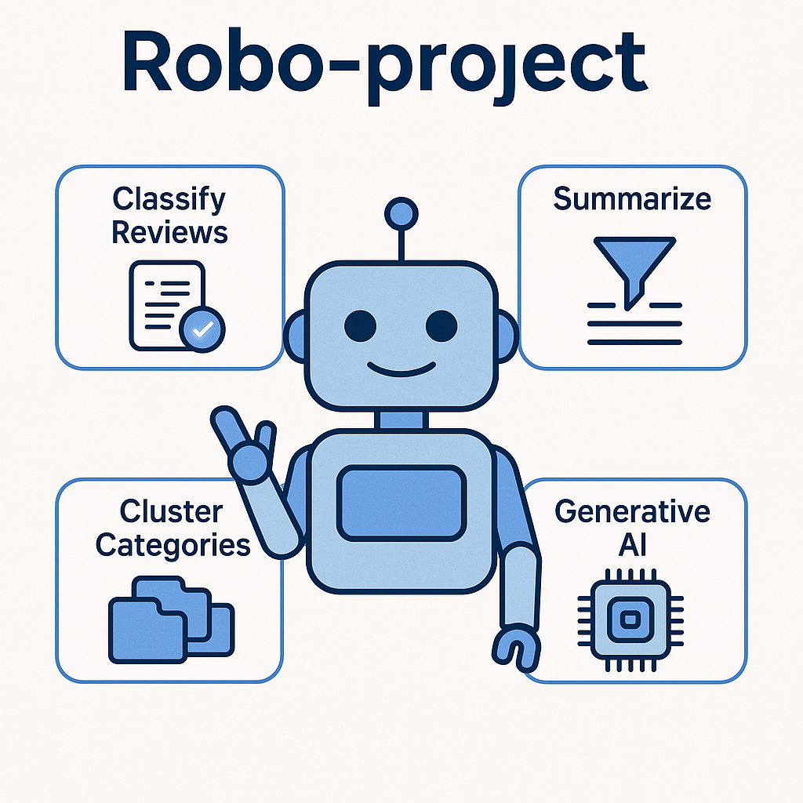
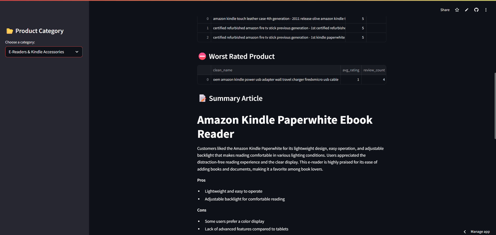

# 🤖 **Robo-project** 🤖  


Stop drowning in endless reviews — this model finds the best product for you!  

A complete **Product Review Intelligence** Dashboard powered by NLP and generative AI. This project showcases a real-world system capable of aggregating, organizing, and summarizing customer feedback from e-commerce platforms.

 Built during my AI bootcamp to demonstrate end-to-end application of NLP, machine learning, and interactive data apps — ideal for product teams, marketing analysts, or data-driven decision-makers.


[👉 Task Descriptions and Instructions](https://github.com/ironhack-labs/project-nlp-business-case-automated-customers-reviews-v2)

🔗 Live Demo: [](https://robo-project-jfrvqubawim2qttpxtckey.streamlit.app/)





---

## 📁  Dataset

- [**Original dataset**: Amazon Product Reviews**](https://www.kaggle.com/datasets/datafiniti/consumer-reviews-of-amazon-products)

These datasets were manually downloaded and combined during the preprocessing step:

1. `.\Dataset\1429_1.csv`  
2. `.\Dataset\Datafiniti_Amazon_Consumer_Reviews_of_Amazon_Products.csv`  
3. `.\Dataset\Datafiniti_Amazon_Consumer_Reviews_of_Amazon_Products_May19.csv`  

---

 ## 🚀 What It Does 
The system processes a large dataset of Amazon product reviews and turns raw user feedback into structured insights using a 3-step NLP pipeline:

**1. 🧾 Review Classification**

Assigns sentiment labels (positive, neutral, negative) to each review using rule-based and/or ML-based sentiment analysis.

Displays sentiment distribution by category.

**2. 🧠 Clustering Product Categories**

Groups products into coherent clusters (e.g., Tablets, Batteries, E-Readers) using unsupervised techniques like TF-IDF + KMeans.

Automatically normalizes product names (removes colors, models, etc.) for aggregation.

**3. ✍️ Generative Summarization**

Uses GPT-3.5 to synthesize product review summaries into human-readable articles.

Highlights:

Top 3 products per category (with pros & cons)

Worst-rated product (and what went wrong)

All summaries are stored as markdown files and dynamically displayed in the web app.


---

## ⚙️ How to Run Locally


```bash
# 1. Clone the repo
git clone https://github.com/Lacave91/Robo-project.git
cd robo-project

# 2. Install dependencies
pip install -r requirements.txt

# 3. Launch app
streamlit run Deployment/app.py
```


